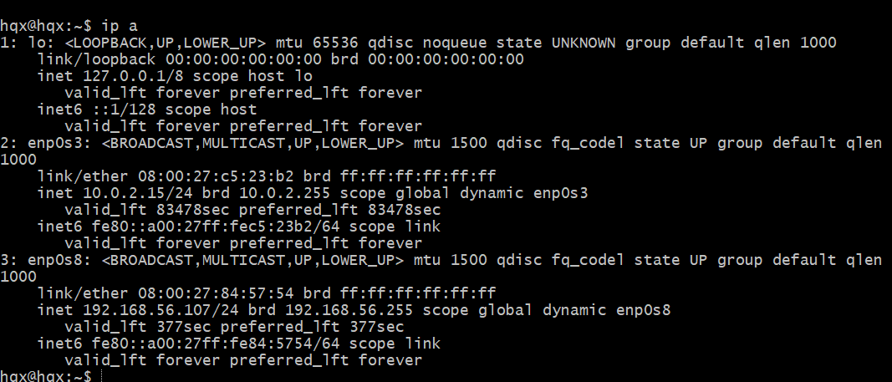

# 无人值守安装iso制作过程

---

## 软件环境
> Virtualbox Ubuntu 20.04 Server 64bit

---

## 主要操作步骤

---

### 提前下载好[纯净版 Ubuntu 安装镜像 iso 文件](https://releases.ubuntu.com/focal/ubuntu-20.04.2-live-server-amd64.iso)
* 创建Ubuntu虚拟机，修改网卡等设置，添加下载好的安装镜像

---

### 手动安装Ubuntu
* 定制用户名和密码
* 定制安装OpenSSh server
*获取 IP

* 在git-bash用ssh远程连接虚拟机 : ssh hqx@192.168.56.107

---

### 得到初始[自动配置描述文件]: `/var/log/installer/autoinstall-user-data`
* `sudo` 更改权限设置 （图片是最开始在cmd里做时截的）

* 用scp将autoinstall-user-data下载到桌面

* 与老师给的user-data进行比较，并做出修改：添加时区，locale:en_US.UTF-8，数字修改

* 主机新建文件 `meta-data`

---

### 创建镜像过程
* 参考 番外章节 Cloud-Init 实验目录中的说明文件
* 安装依赖工具 : sudo apt install genisoimage

* 用sftp将 user-data 和 meta-data 传入虚拟机

* 创建 cloud-init 镜像 ：genisoimage -output init.iso -volid cidata -joliet -rock user-data meta-data

* 得到包含 `user-data` 和 `meta-data` 的 ISO 镜像文件，假设命名为 `focal-init.iso`

---

### 创建新Ubuntu虚拟机并修改设置
* 同手工安装系统步骤，新建可以用于安装 `Ubuntu 64位系统` 的虚拟机配置

* 移除上述虚拟机「设置」-「存储」-「控制器：IDE」
* 在「控制器：SATA」下新建 2 个虚拟光盘，分别挂载「纯净版 Ubuntu 安装镜像文件」和 `focal-init.iso`

* 启动虚拟机，稍等片刻会看到命令行中出现以下提示信息。此时，需要输入 `yes` 并按下回车键，剩下的就交给「无人值守安装」程序自动完成系统安装和重启进入系统可用状态了
> Continue with autoinstall? (yes/no)
* 最终结果

---

## 实验问题

## 1.如何使用sftp在虚拟机和宿主机之间传输文件？
* [参考](https://blog.csdn.net/weixin_41456835/article/details/78974350)

## 2.手动安装 Ubuntu 一直卡住很久（后来发现只是装得非常非常慢）

* [参考](https://blog.csdn.net/Lazybones_3/article/details/104121705)
* 改使用阿里镜像源

## 3.传输 autoinstall-user-data 时出现错误

* 猜测原因是路径含有中文，参考语雀同学类似问题，修改git bash中“text”的“Character set”设置为 UTF-8
* [参考](https://blog.csdn.net/u013068377/article/details/52168434)
* 

