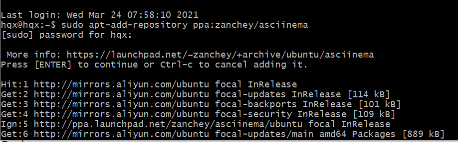
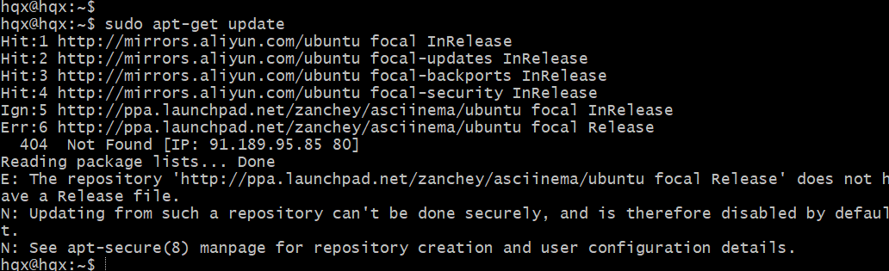
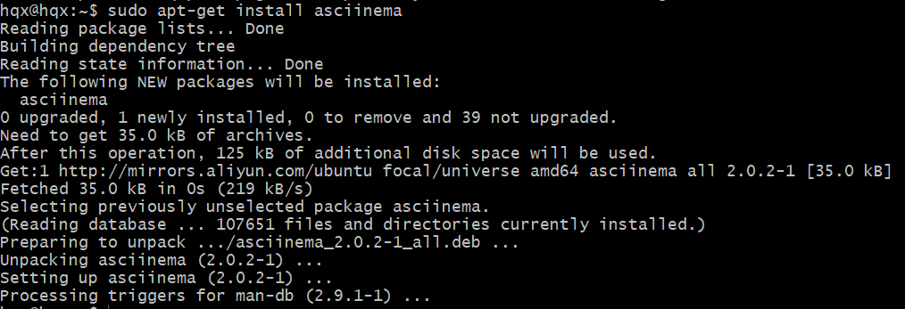
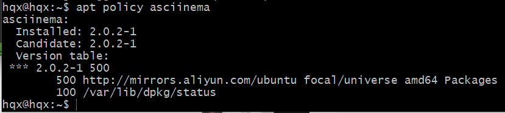
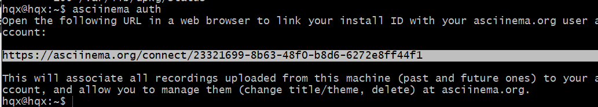
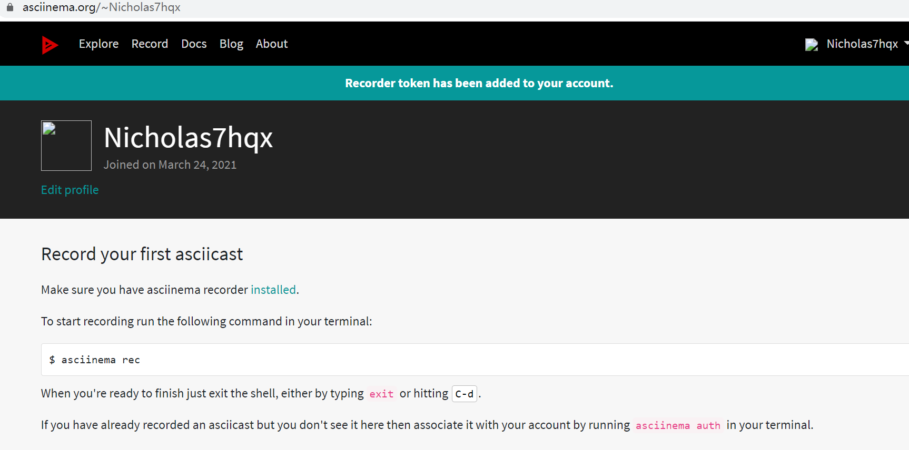
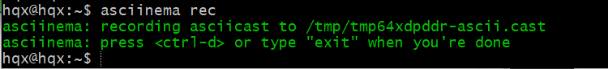

# 实验二

## 一、实验目的
- 完成vimtutor操作并全程录像

## 二、软件环境
- Linux, Ubuntu 20.04
- 在asciinema注册一个账号，并在本地安装配置好asciinema

## 三、实验过程

### 1.环境配置
- ssh远程连接虚拟机后，安装录像工具asciinema

- 安装完成后可查看到asciinema当前及候选版本

- 确保本地已经完成asciinema auth

- 在asciinema成功关联本地账号和在线账号

- 开始录制

### 2.全程录像
- [lesson 1.1-1.2](https://asciinema.org/a/HBP9EFXgXiLaxQCSxbJr5XAIj)：移动光标，VIM的进入和退出
- [lesson 1.3-1.summary](https://asciinema.org/a/AepLe9zvckgLCdhFvDW1XFoBD)：文本编辑之删除、插入、添加，编辑文件

- [lesson 2.1-2.4](https://asciinema.org/a/hJeeNf7idWzl9ajJb4nJYUlVb)：删除类命令，关于命令和对象，使用计数指定动作

- [lesson 2.5-2.summary](https://asciinema.org/a/DytsZdKbWatu61X5Tb281G9JY)：使用计数以删除更多，操作整行，撤消类命令

- [lesson 3.1-3.4](https://asciinema.org/a/qPqXZl179ueInzWGUOA8lumWc)：置入类命令，替换类命令，更改类命令，使用c更改更多

- [lesson 3.summary-4.3](https://asciinema.org/a/6mRPoLsSE66Gkoe1A9rM1Tait)定位及文件状态，搜索类命令，配对括号的查找

- [lesson 4.4-4.summary](https://asciinema.org/a/eEKOcqH73KxUce1y0iGiwAVGZ)：替换命令

- [lesson 5.1-5.3](https://asciinema.org/a/W79WxBQclbW634dd6VuelNjfe)：在VIM内执行外部命令的方法，关于保存文件的更多信息，一个具有选择性的保存命令

- [lesson 5.4-5.summary](https://asciinema.org/a/OYUv3OuM8qEfziacij8NgIxSA)：提取和合并文件

- [lesson 6.1-6.3](https://asciinema.org/a/XRIjtbg53xu1iiFxlGepmjpTK)：打开类命令，附加类命令，另外一个置换类命令的版本

- [lesson 6.4-6.summary](https://asciinema.org/a/nWp5o9PLwuzyLDRl8B0wjwIU6)：复制粘贴文本，设置类命令的选项

- [lesson 7.1-7.2](https://asciinema.org/a/h9H4QNbearmXkpRWinvA58X7D)：获取帮助信息，创建启动脚本

- [lesson 7.3-7.summary](https://asciinema.org/a/GNzfftdjZM7Wgu1Ly8WNPbJ27)：补全功能

## 四、问题清单
#### 1. 你了解vim有哪几种工作模式？

- 一：normal模式； 二：编辑模式； 三：命令模式； 四：可视化模式

#### 2.Normal模式下，从当前行开始，一次向下移动光标10行的操作方法？如何快速移动到文件开始行和结束行？如何快速跳转到文件中的第N行？

- 10G ; gg ; G ; nG

#### 3.Normal模式下，如何删除单个字符、单个单词、从当前光标位置一直删除到行尾、单行、当前行开始向下数N行？

- x:删除光标所在位置的字符 ;
  dw:删除光标后单个单词 ;
  d$:从光标位置删除到行尾 ;
  dd:删除单行 ;
  ndd:删除当前行开始向下数n行 ;

#### 4.如何在vim中快速插入N个空行？如何在vim中快速输入80个-？

- o/O:插入N个空行 ;

#### 5.如何撤销最近一次编辑操作？如何重做最近一次被撤销的操作？

- u:撤销最近一次编辑操作 ;
  CTRL-R:重做最近一次被撤销的操作 ;

#### 6.vim中如何实现剪切粘贴单个字符？单个单词？单行？如何实现相似的复制粘贴操作呢？

- v + j/k/h/l + d + p:剪切粘贴单个字符 ;
  v + j/k/h/l + dw + p:剪切粘贴单个单词 ;
  v + $ + d + p:剪切粘贴单行 ;
  d换成y:相似的复制粘贴操作 ;

#### 7.为了编辑一段文本你能想到哪几种操作方式（按键序列）？

- x/i/a/d/y/p...:编辑文本 ;

#### 8.查看当前正在编辑的文件名的方法？查看当前光标所在行的行号的方法？

- :!ls ;
  CTRL-G:查看当前光标所在行号 ;

#### 9.在文件中进行关键词搜索你会哪些方法？如何设置忽略大小写的情况下进行匹配搜索？如何将匹配的搜索结果进行高亮显示？如何对匹配到的关键词进行批量替换？

- /word:关键词搜索 ;
  :set ic:忽略大小写搜索 ;
  :set hls is:高亮显示 ;
  %s/old/new/gc:批量替换 ;

#### 10.在文件中最近编辑过的位置来回快速跳转的方法？

- CTRL-O/CTRL-I:在最近编辑过的位置快速跳转 ;

#### 11.如何把光标定位到各种括号的匹配项？例如：找到(, [, or {对应匹配的),], or }

- %:定位到括号匹配项 ;

#### 12.在不退出vim的情况下执行一个外部程序的方法？

- :! :执行外部程序 ;

#### 13.如何使用vim的内置帮助系统来查询一个内置默认快捷键的使用方法？如何在两个不同的分屏窗口中移动光标？

- help:使用内置帮助系统 ;
  CTRL-W CTRL-W:在两个不同的分屏窗口中移动光标 ;

---