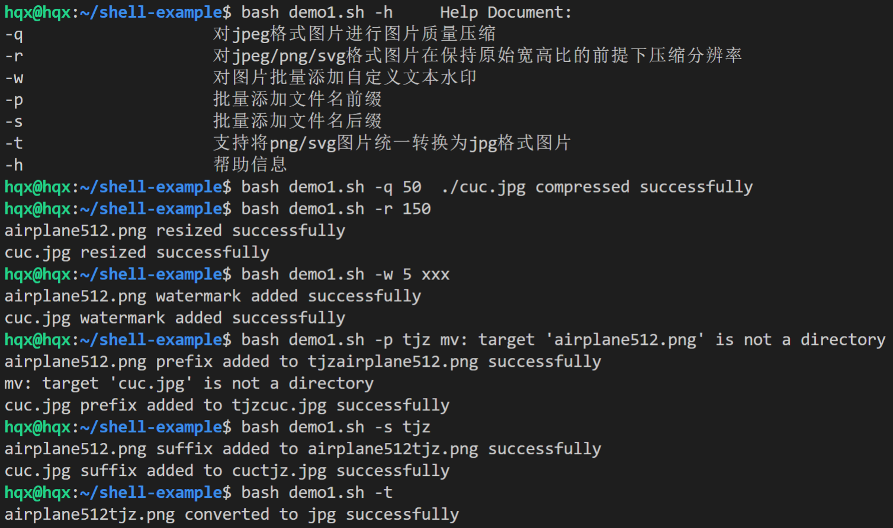
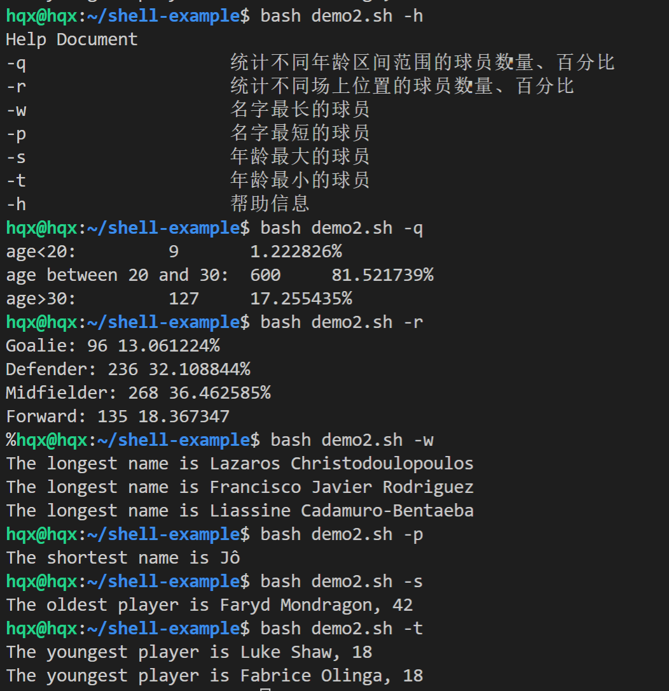
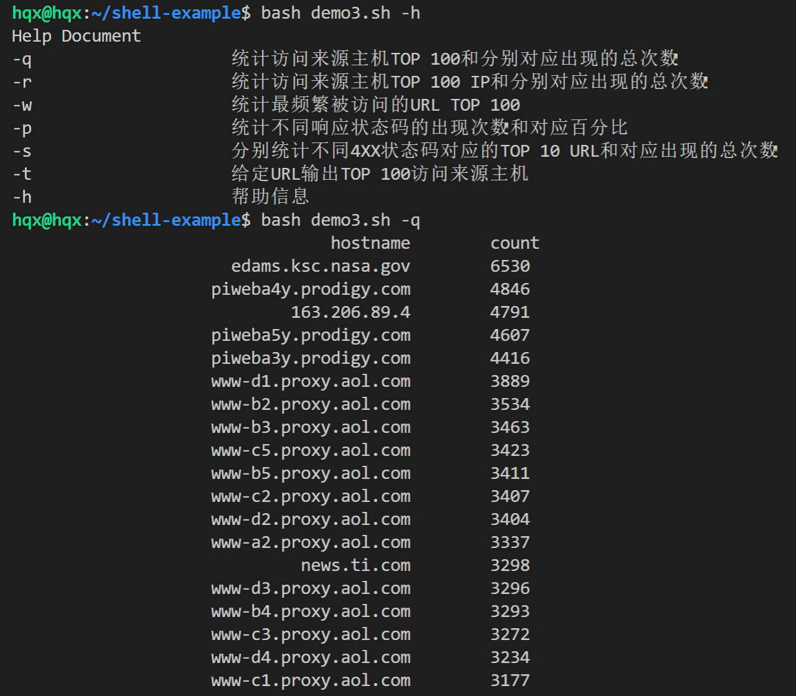
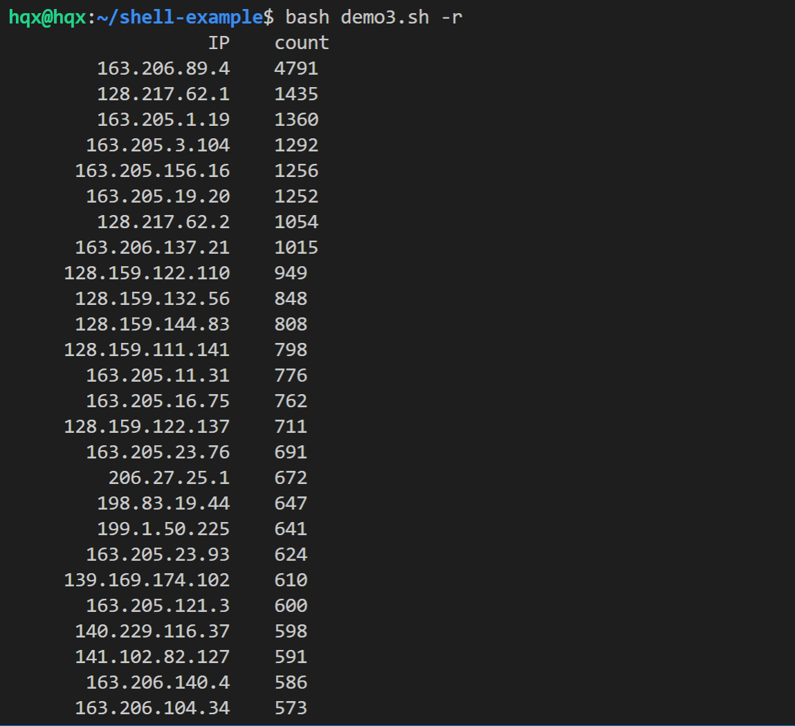
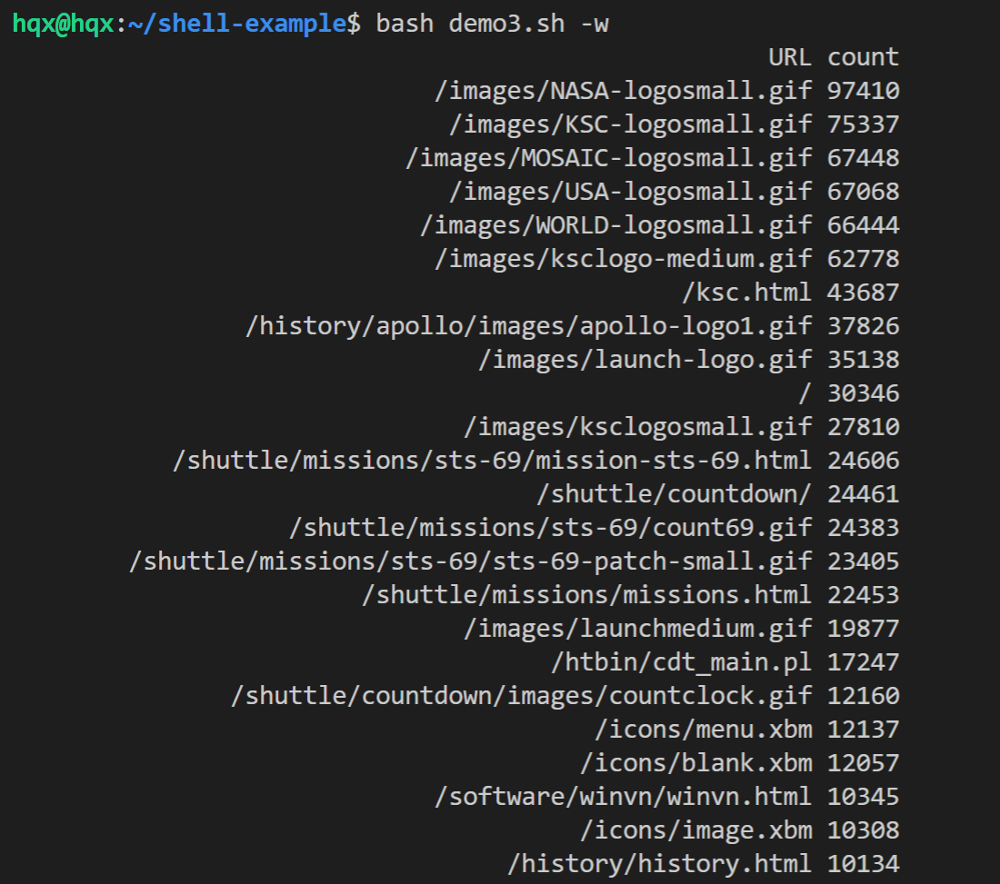
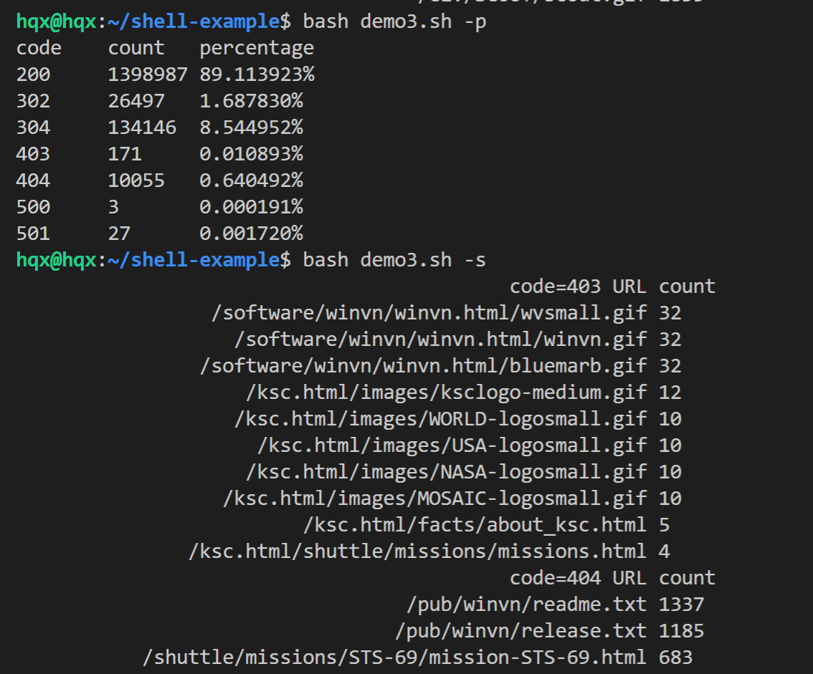
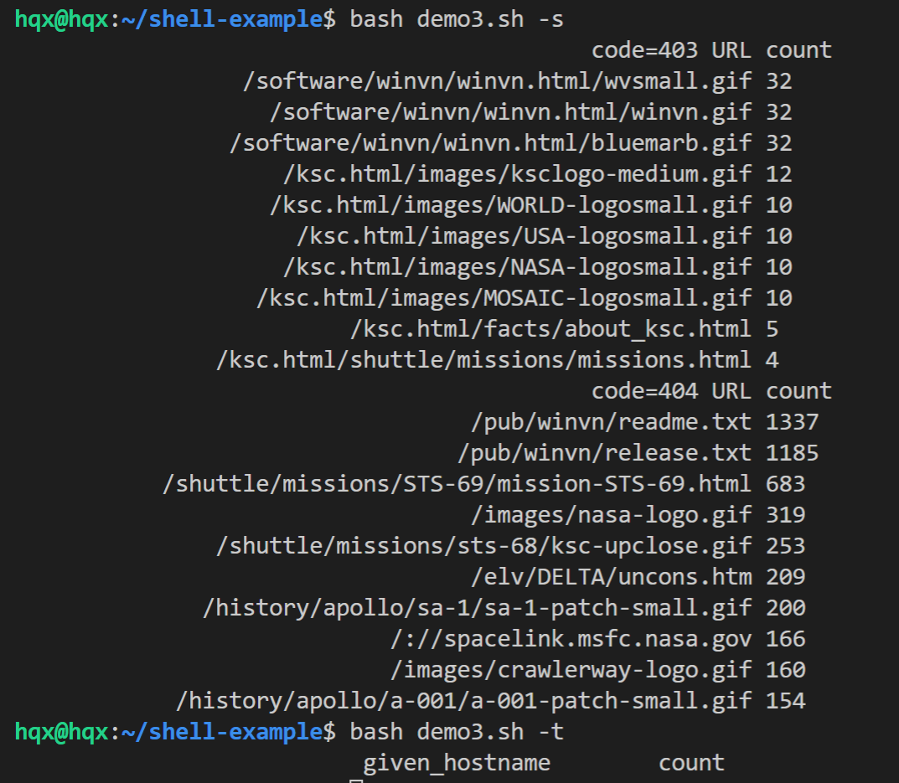

# 实验四 shell脚本编程基础

## 一、实验目的
- 对图片、文本进行批处理的shell脚本编程练习

## 二、实验环境
- Ubuntu 20.04
- 基于VSCode remote的Bash

## 三、任务清单
### 1. 任务一：
* 支持命令行参数方式使用不同功能
* 支持对指定目录下所有支持格式的图片文件进行批处理指定目录进行批处理
* 支持以下常见图片批处理功能的单独使用或组合使用
* 支持对jpeg格式图片进行图片质量压缩
* 支持对jpeg/png/svg格式图片在保持原始宽高比的前提下压缩分辨率
* 支持对图片批量添加自定义文本水印
* 支持批量重命名（统一添加文件名前缀或后缀，不影响原始文件扩展名）
* 支持将png/svg图片统一转换为jpg格式

### 2. 任务二：

* 统计不同年龄区间范围（20岁以下、[20-30]、30岁以上）的球员数量、百分比
* 统计不同场上位置的球员数量、百分比
* 名字最长的球员是谁？名字最短的球员是谁？
* 年龄最大的球员是谁？年龄最小的球员是谁？

### 3. 任务三：

* 统计访问来源主机TOP 100和分别对应出现的总次数
* 统计访问来源主机TOP 100 IP和分别对应出现的总次数
* 统计最频繁被访问的URL TOP 100
* 统计不同响应状态码的出现次数和对应百分比
* 分别统计不同4XX状态码对应的TOP 10 URL和对应出现的总次数
* 给定URL输出TOP 100访问来源主机

## 四、实验过程及结果
### 1. 任务一：
- 安装ImageMagick 
```bash
sudo apt-get update && sudo apt-get install imagemagick
```

- 数据结果：  


### 2. 任务二：
- 数据结果：  


### 3. 任务三：
- 数据结果（图一）：  

- 数据结果（图二）：  

- 数据结果（图三）：  

- 数据结果（图四）：  

- 数据结果（图五）：  


## 五、遇到问题：
- demo2代码中查找名字最短的球员应给min赋较大的值，不能为0。

## 六、参考文献：
1. 遍历文件写法：  
[https://mywiki.wooledge.org/BashPitfalls](https://mywiki.wooledge.org/BashPitfalls)
2. 同学的实验报告：  
[https://github.com/CUCCS/2021-linux-public-lsw666-gif/tree/Chap0x04/chapter4](https://github.com/CUCCS/2021-linux-public-lsw666-gif/tree/Chap0x04/chapter4)
3. awk用法：  
[https://www.cnblogs.com/superdo/p/4455407.html#id-awk](https://www.cnblogs.com/superdo/p/4455407.html#id-awk)